# couch-pi
Robotic couch that runs on a Raspberry Pi Zero W with a Bluetooth Android App controller (and lots more to come). This project was inspired by the original RAS couch ([github](https://github.com/ut-ras/couch-firmware), [video 1](https://www.youtube.com/watch?v=L9J6vn5uEHM), [video 2](https://www.youtube.com/watch?v=2wl4B_LGgxU)).


## Current Couch
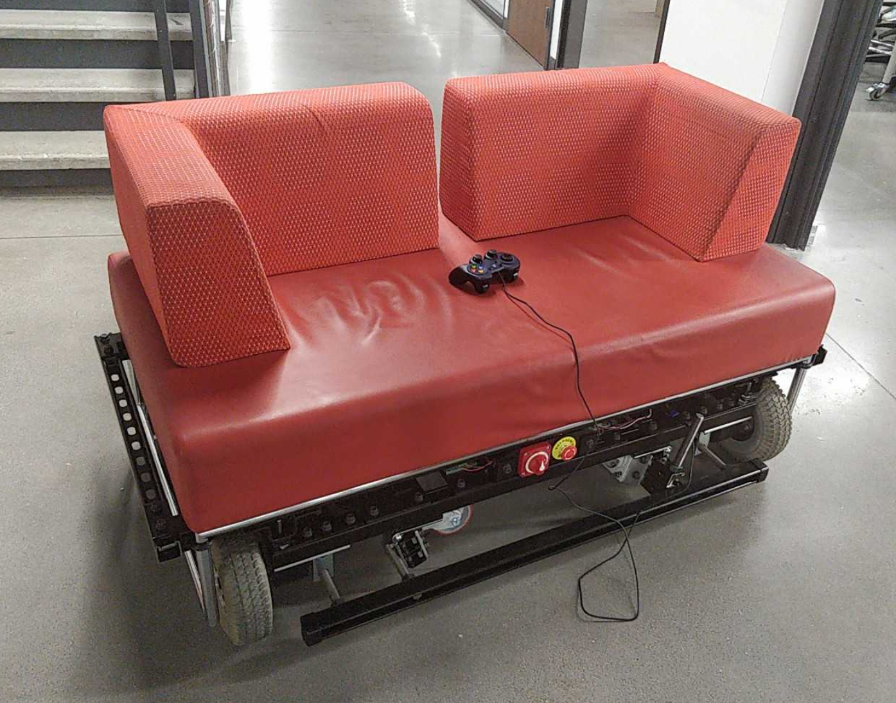


## Parts List
Detailed Hardware BOM and CAD will be added soon
* [Two Sabertooth 2x60 Dual 60A Motor Drivers](https://www.amazon.com/Sabertooth-2x60-Dual-Motor-Driver/dp/B00B3Z347W) in Packetized Serial mode
* Four DC Motors and Wheels
* [Raspberry Pi Zero W](https://www.adafruit.com/product/3400)
* [Logitech Gamepad F310](https://www.amazon.com/Logitech-940-000110-Gamepad-F310/dp/B003VAHYQY/ref=sr_1_4?ie=UTF8&qid=1550446653&sr=8-4&keywords=pc+gamepad) and MicroUSB to USB Adapter
* Neopixel RGB LED Strip
* [Emergency Stop Button](https://www.amazon.com/JMAF-Mushroom-Emergency-Button-Switch/dp/B07BCY7HGN)
* [300A Power Switch](https://www.amazon.com/Blue-Sea-Systems-Battery-Switch/dp/B00445KFZ2)
* [Fuse Block](https://www.amazon.com/gp/product/B000K2K7TW) and [Fuse](https://www.amazon.com/gp/product/B005EUTA3E)
* [Two 12V Lead Acid Batteries in series](https://www.amazon.com/Universal-UB12550GRP22NF-UB12550-Group-Battery/dp/B00HSW8FYQ)
* [24V Sealed Lead Acid Battery Charger](https://www.amazon.com/gp/product/B072Y228D6) with Fuel Gage
* [4 Gage Wire](https://www.mcmaster.com/6948k92) for Battery connections
* [10 Gage Wire](https://www.mcmaster.com/6659t18) for Motor connections

## Block Diagram
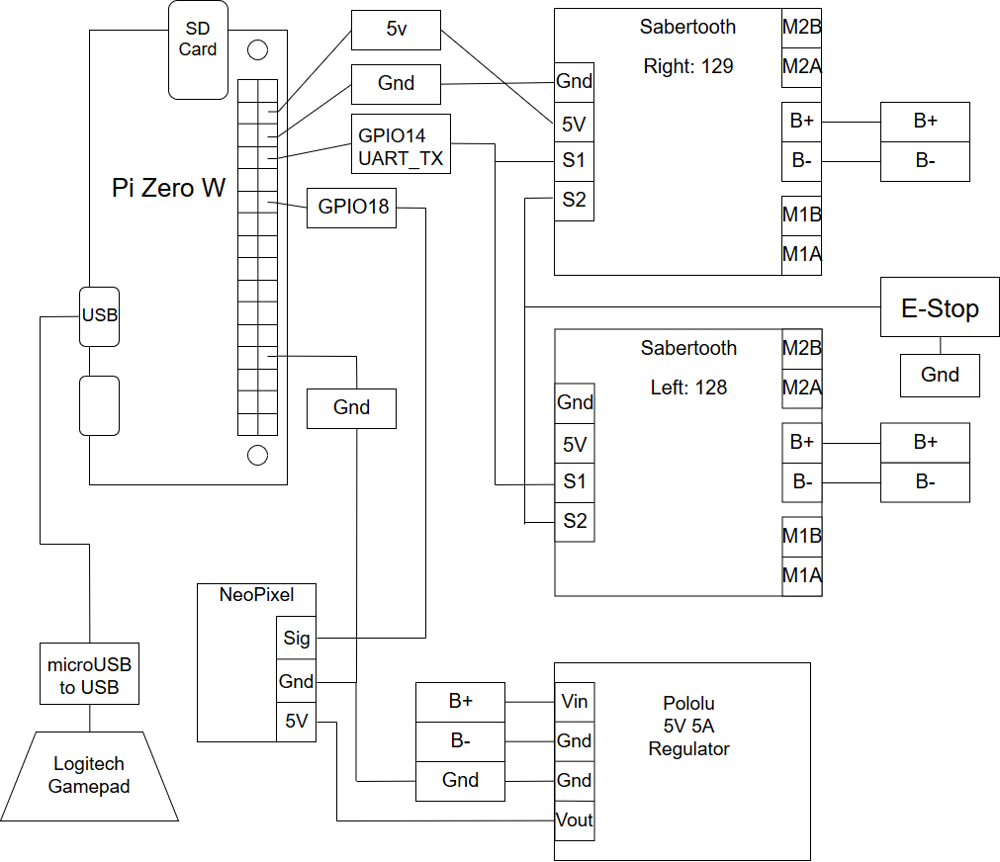

## Software
### Python Couch Library for Raspberry Pi
 * `Controllers/`
     * Update leftMotorPercent and rightMotorPercent
     * `Controller.py` - Base controller class
     * `LogitechGamepad.py`
     * `bluetoothController.py`
 * `Couches/`
     * Couch is the main control module and contains a Drivetrain and other hardware attached to the couch. 
     * Reads leftMotorPercent and rightMotorPercent from Controller and updates the Drivetrain
     * Controller can be set, in the future we might want to switch which controller is active (physical backup controller for wireless)
     * `Couch.py` - Base couch class
     * `testBenchCouch.py` - Current couch implementation, contains an LED strip and tank drivetrain. Uses a fixed Timer to update the drivetrain with controller values
 * `Drivetrains/`
     * Communicates with the Sabertooth Motor Controllers to drive the Motors
     * `TankDrivetrain.py` - Tank Drive, motors on the same side are set to the same percent
     * `TankDrivetrainAcceleration.py` - Tank Drive. Increments motor percents towards a setpoint over time. Can set this in a background timer or call manually
 * `Drivers/`
     * `Sabertooth.py` - Sabertooth driver
     * `Led.py` - LED functions and modules 
 * `driveTest.py` - main file, launches Couch and Controller
### Pi Setup
Install Requirements
```
# Install requirements with root
sudo apt-get install python3-pip
sudo pip3 install -r requirements.txt
```
Enable UART
```
sudo vim /boot/config.txt
    enable_uart=1       # add this line
```
Test run
```
sudo python3 driveTest.py
```

Run python file in background at startup with log files
```
cd couch-pi/pi
mkdir logs                  # Make sure logs folder exists
sudo vim /etc/rc.local
    [...]
    sudo python3 /home/pi/couch-pi/pi/driveTest.py > /home/pi/couch-pi/pi/logs/log.$(date "+%Y.%m.%d-%H.%M.%S").txt 2>&1 &
    # add the above line right before exit 0
    exit 0      
```
### android
Android App - Wireless Bluetooth Controller
```
android/app-debug.apk
pi/Controllers/bluetoothController.py
```


## CAD
CAD by Daniel Teal
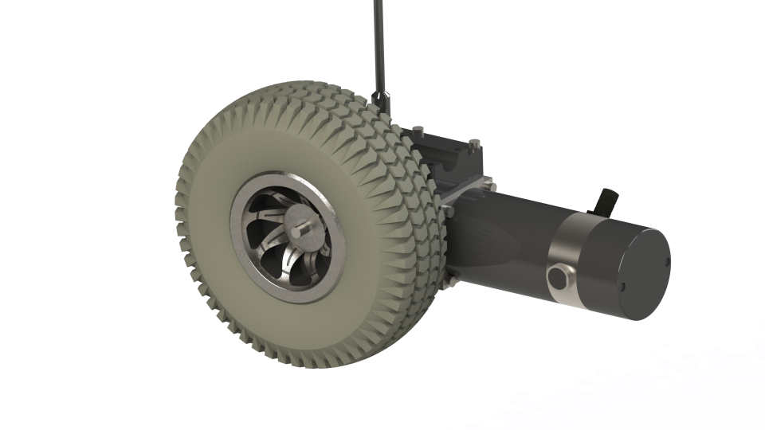
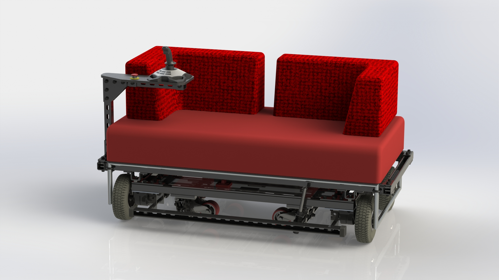
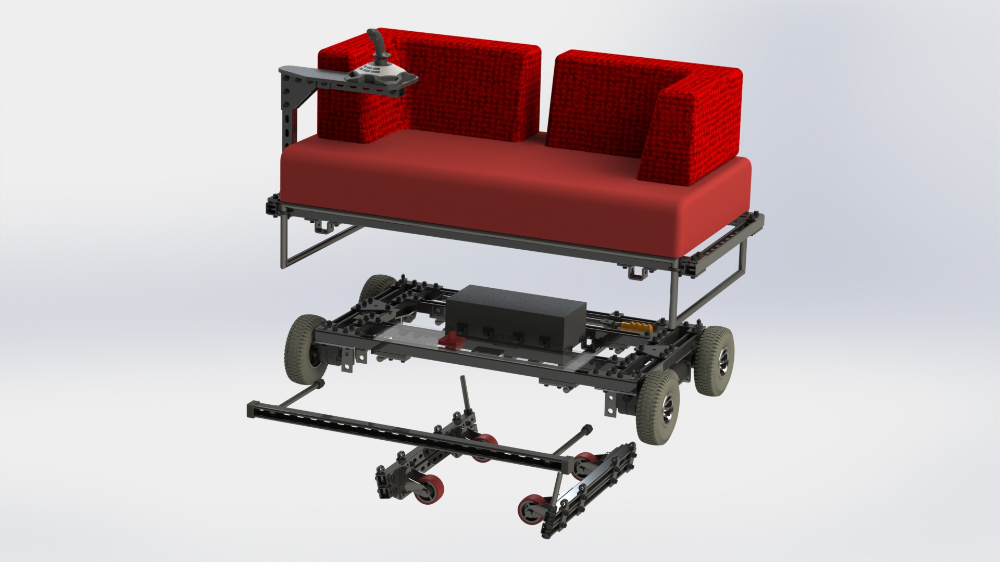


## Construction
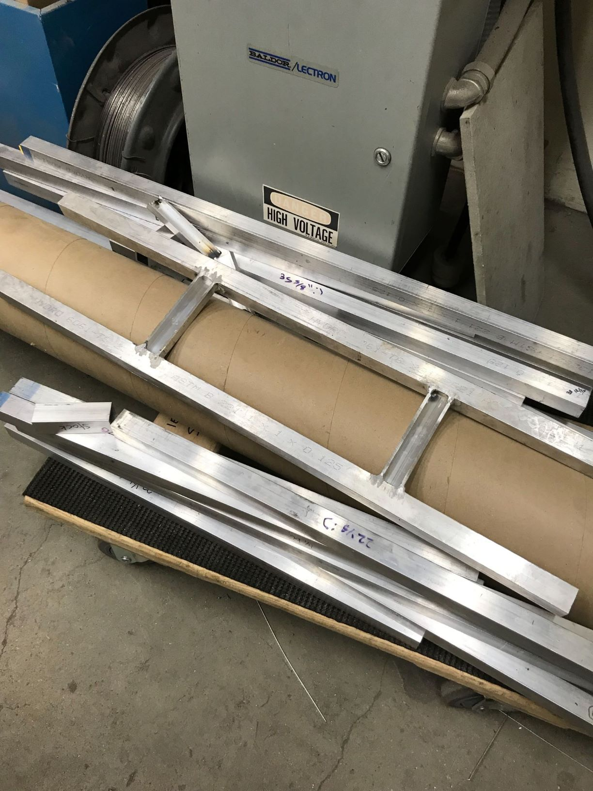
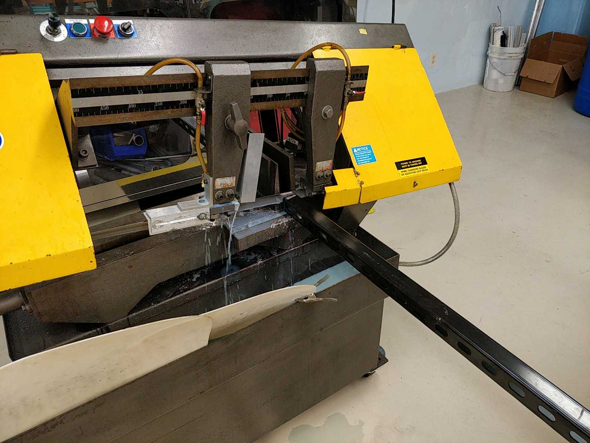
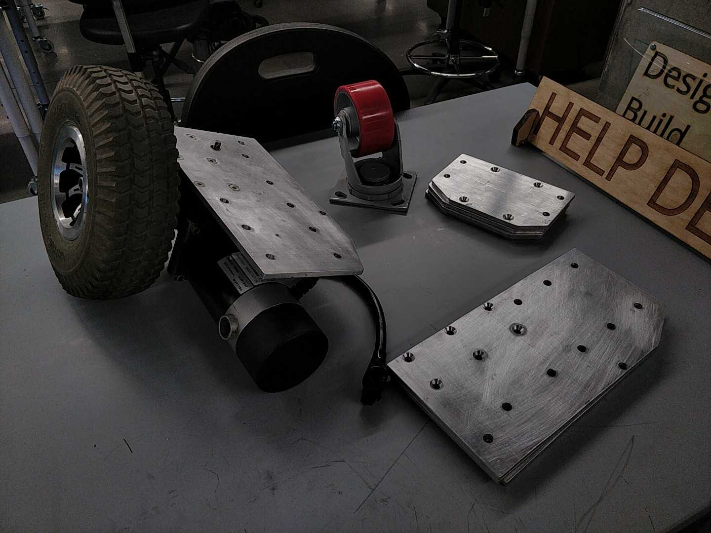
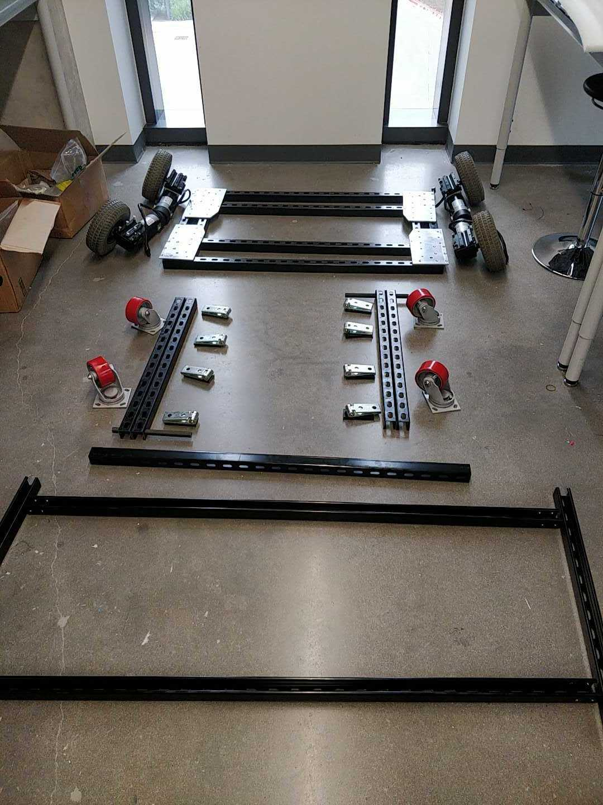
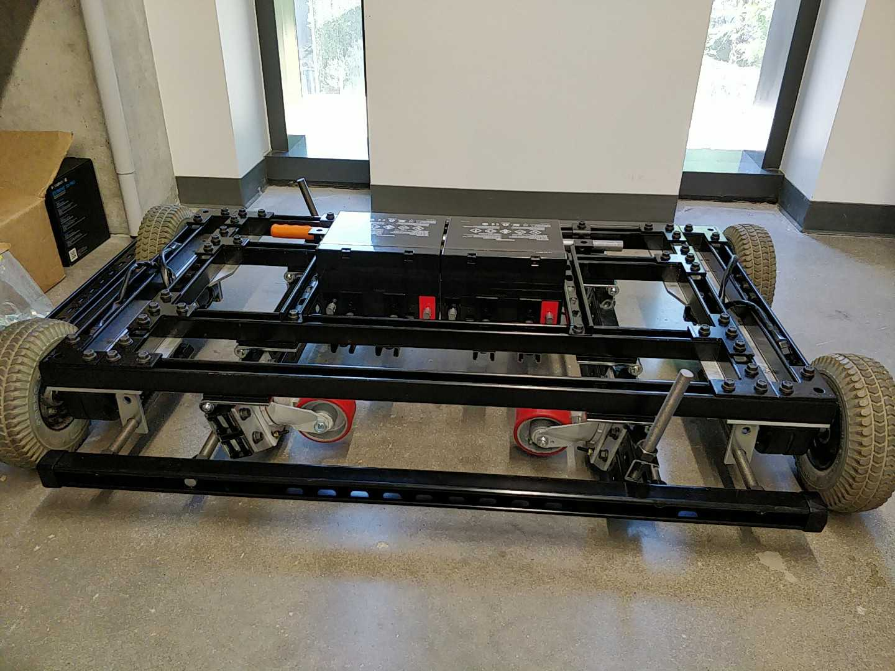
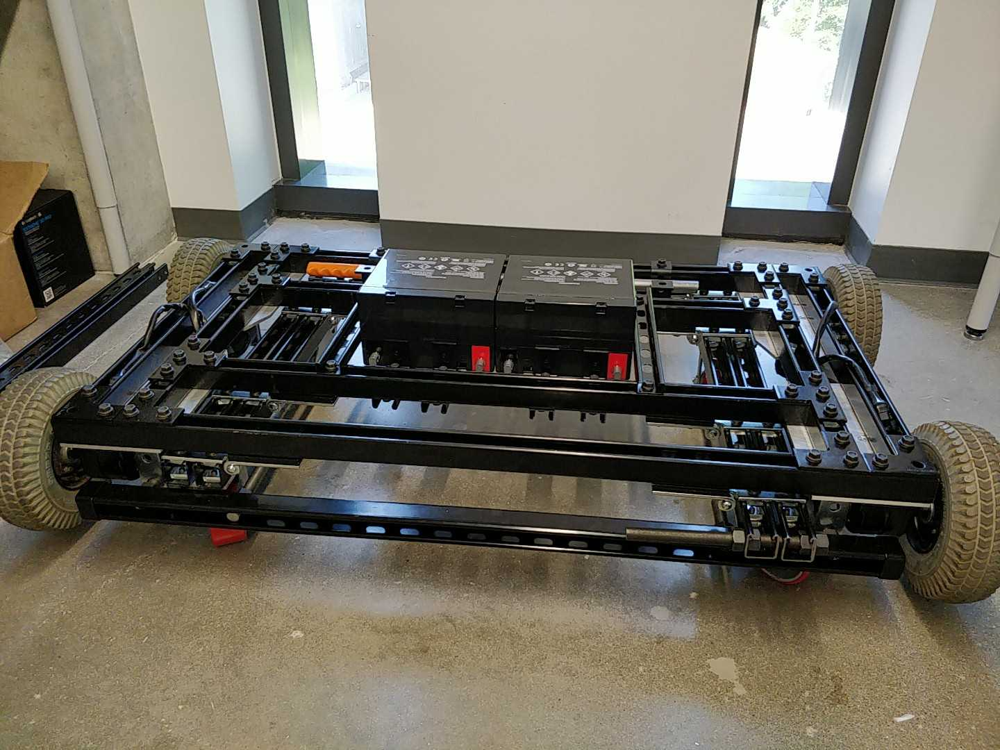
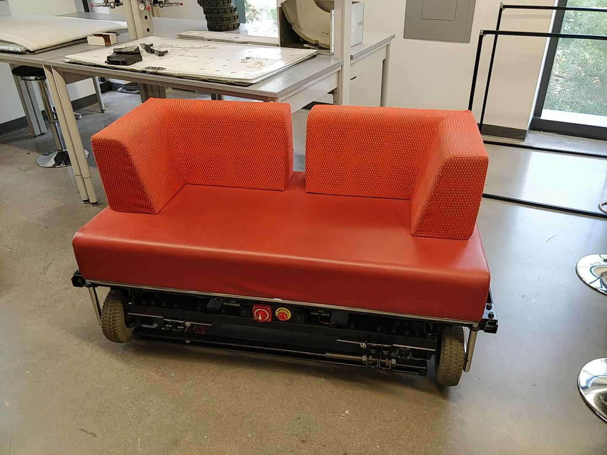
